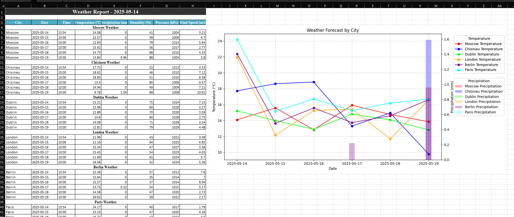
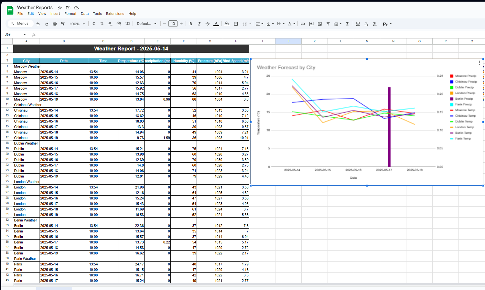

# Weather Report Automation

This project automates the generation of weather reports for six cities (Moscow, Chisinau, Dublin, London, Berlin, Paris), including current weather and a 5-day forecast. Reports are generated in Excel (with `minimal`, `modern`, and `corporate` styles) and Google Sheets (corporate style). Each report includes a table with 36 rows (6 cities × 6 records) and 8 columns, along with a combined chart (line for temperature, bars for precipitation).

## Features
- **Cities**: Moscow, Chisinau, Dublin, London, Berlin, Paris.
- **Data**: Current weather + 5-day forecast (temperature, precipitation, humidity, pressure, wind speed).
- **Output**:
  - **Excel**: Three styles (`minimal`, `modern`, `corporate`) with formatted tables and charts.
  - **Google Sheets**: Corporate style with a table and an automated combined chart.
- **Scheduling**: Daily report generation at 9:00 AM (configurable).
- **Charts**:
  - Excel: Line (`minimal`), bar (`modern`), or combined (`corporate`) charts with city-specific colors.
  - Google Sheets: Combined chart with temperature (lines) and precipitation (bars), city-specific colors.
- **City Colors**:
  - Moscow: Red (#FF0000)
  - Chisinau: Blue (#0000FF)
  - Dublin: Green (#00FF00)
  - London: Orange (#FFA500)
  - Berlin: Purple (#800080)
  - Paris: Cyan (#00FFFF)

## Screenshots
### Excel Report (Corporate Style)

*Table with 36 rows, 8 columns, and a combined chart (temperature lines, precipitation bars).*

### Google Sheets Report (Corporate Style)

*Table with 36 rows, 8 columns, chart data (I4:U10), and a combined chart below (A51).*

## Requirements
- Python 3.8+
- Libraries: `pandas`, `openpyxl`, `matplotlib`, `gspread`, `google-auth`, `google-api-python-client`, `gspread-formatting`, `requests`, `python-dotenv`
- OpenWeatherMap API key
- Google Service Account credentials (JSON) with access to Google Sheets API and Google Drive API

## Installation
1. Clone the repository and checkout the `extended-version` branch:
   ```bash
   git clone https://github.com/Rostislav62/WeatherReportAutomation.git
   cd WeatherReportAutomation
   git checkout extended-version
   ```
2. Create a virtual environment and install dependencies:
   ```bash
   python -m venv venv
   source venv/bin/activate  # On Windows: venv\Scripts\activate
   pip install -r requirements.txt
   ```
3. Set up environment variables:
   - Copy `.env.example` to `.env`:
     ```bash
     cp .env.example .env
     ```
   - Edit `.env` with your OpenWeatherMap API key and Google Service Account credentials:
     ```env
     OPENWEATHER_API_KEY=your_openweathermap_api_key
     GOOGLE_SHEETS_CREDENTIALS=path/to/credentials.json
     GOOGLE_SHEETS_CLIENT_EMAIL=your_service_account_email
     ```
4. Share the Google Sheet (`Weather Reports`) with the Service Account email (from `credentials.json`) as an Editor.

## Usage
Run the script with a specified style (`minimal`, `modern`, `corporate`):
```bash
python src/main.py --once --style corporate
```
- `--once`: Generate a single report.
- `--style`: Choose `minimal`, `modern`, or `corporate` (default: `minimal`).
- Without `--once`, the script schedules daily reports at 9:00 AM (configurable in `main.py`).

Output:
- **Excel**: `weather_report_{style}_{timestamp}.xlsx` in the project root.
- **Google Sheets**: Updated `Weather Reports` sheet with table and chart.

## Automatic Scheduling
The script can run daily at 9:00 AM (configurable in `main.py`). To ensure automatic execution, set up a scheduled task in your operating system.

### Windows (Task Scheduler)
1. Create a batch file (`run_report.bat`) in the project root:
   ```bat
   @echo off
   cd /d "C:\path\to\WeatherReportAutomation"
   call venv\Scripts\activate
   python src\main.py --style corporate
   deactivate
   ```
   - Replace `C:\path\to\WeatherReportAutomation` with your project path.
2. Open Task Scheduler:
   - Press Win+R, type `taskschd.msc`, and press Enter.
3. Create a task:
   - Click "Create Task" in the right panel.
   - **General**:
     - Name: `WeatherReportDaily`
     - Description: `Daily weather report generation at 9:00 AM`
     - Select "Run whether user is logged on or not" and "Run with highest privileges".
   - **Triggers**:
     - New > "On a schedule" > Daily, 09:00:00 > Enable.
   - **Actions**:
     - New > "Start a program" > Path to `run_report.bat` (e.g., `C:\path\to\WeatherReportAutomation\run_report.bat`).
   - **Conditions**: Uncheck "Start the task only if the computer is on AC power".
   - **Settings**: Enable "Restart if the task fails" (10-minute interval, 3 attempts).
   - Click OK and enter your Windows user password.
4. Test the task:
   - Right-click the task in Task Scheduler and select "Run".
   - Verify that the Excel file and Google Sheet are updated.

### Linux/macOS (Cron)
1. Create a shell script (`run_report.sh`) in the project root:
   ```bash
   #!/bin/bash
   cd /path/to/WeatherReportAutomation
   source venv/bin/activate
   python src/main.py --style corporate
   deactivate
   ```
   - Replace `/path/to/WeatherReportAutomation` with your project path.
   - Make it executable:
     ```bash
     chmod +x run_report.sh
     ```
2. Edit the crontab:
   ```bash
   crontab -e
   ```
   - Add:
     ```bash
     0 9 * * * /path/to/WeatherReportAutomation/run_report.sh
     ```
   - Save and exit.
3. Test the script:
   ```bash
   ./run_report.sh
   ```
   - Verify that the Excel file and Google Sheet are updated.

## Project Structure
```
WeatherReportAutomation/
├── src/
│   ├── api.py              # Fetches weather data from OpenWeatherMap
│   ├── report.py           # Generates Excel and Google Sheets reports
│   ├── main.py             # Main script to run or schedule reports
│   ├── scheduler.py        # Scheduling logic
├── screenshots/            # Screenshots of reports
├── .env.example           # Example environment file
├── requirements.txt        # Python dependencies
├── README.md              # Project documentation
```

## Configuration
- **OpenWeatherMap API**: Get a free API key from [openweathermap.org](https://openweathermap.org/).
- **Google Sheets**:
  - Create a Service Account in Google Cloud Console.
  - Enable Google Sheets API and Google Drive API.
  - Download `credentials.json` and specify its path in `.env`.
  - Share the `Weather Reports` sheet with the Service Account email.
- **Scheduling**: Edit `daily_time` in `main.py` to change the report time (e.g., `"09:00"`).

## Troubleshooting
- **No chart in Google Sheets**:
  - Check `credentials.json` for Google Sheets API and Drive API access.
  - Verify Service Account email is shared with the `Weather Reports` sheet.
  - Check console output for `Error creating chart: ...`.
- **Weather data missing**:
  - Ensure `OPENWEATHER_API_KEY` is valid.
  - Check API response in console logs (enable debug output in `api.py`).
- **Excel chart issues**:
  - Verify `matplotlib` and `openpyxl` are installed.
  - Check `weather_chart.png` in the project root.
- **Scheduled task fails**:
  - Windows: Ensure `run_report.bat` has correct paths and Task Scheduler uses the right user credentials.
  - Linux/macOS: Verify `run_report.sh` is executable and cron is running (`service cron status`).

## Contributing
Contributions are welcome! Please create a pull request to the `extended-version` branch.

## License
MIT License